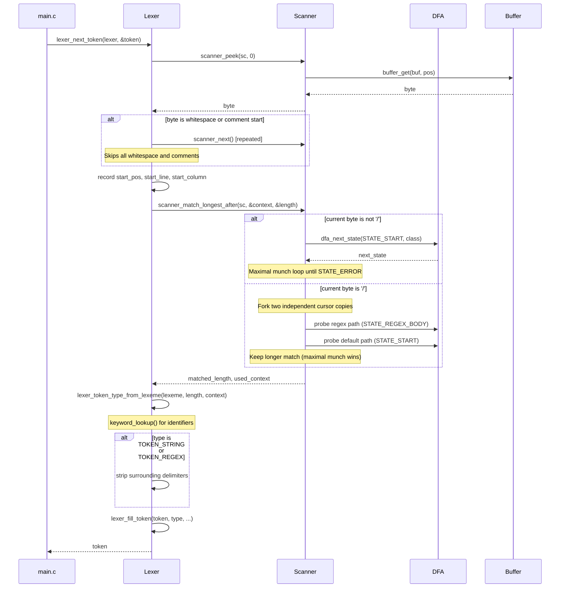

# esjs-custom-lexer

A hand-written lexical analyzer (lexer / tokenizer) for **EsJS**, a
Spanish-syntax dialect of JavaScript. The lexer is implemented in C11 and
uses a table-driven Deterministic Finite Automaton (DFA) as its core
recognition engine.

---

## Table of Contents

- [Project Overview](#project-overview)
- [Architecture](#architecture)
- [Processing Flow](#processing-flow)
- [DFA Design](#dfa-design)
- [Design Decisions](#design-decisions)
- [Token Reference](#token-reference)
- [Building and Running](#building-and-running)
- [Using as a Library](#using-as-a-library)
- [Thread Safety](#thread-safety)
- [Output Format](#output-format)

---

## Project Overview

EsJS (https://es.js.org) is a variant of JavaScript that uses Spanish reserved
words. This lexer takes EsJS source code on standard input and emits a sequence
of tokens to standard output, one per line, in a structured text format.

The implementation is self-contained: no external libraries are required beyond
the C standard library.

**Language standard:** C11  
**Build systems:** CMake (primary) and GNU Make  
**Compiler flags:** `-Wall -Wextra` with full warnings enabled  
**Code style:** Google C style (enforced via `.clang-format`)

---

## Architecture

The lexer is organized as a layered pipeline. Each layer has a single
responsibility and communicates only with its immediate neighbors.

```
┌──────────────────────────────────────────────────────────────────┐
│                           main.c                                 │
│                  CLI driver / output formatter                   │
└───────────────────────────┬──────────────────────────────────────┘
                            │ lexer_next_token()
┌───────────────────────────▼──────────────────────────────────────┐
│                           Lexer                                  │
│   - Skips whitespace and comments                                │
│   - Records source position                                      │
│   - Resolves token type from raw lexeme                          │
│   - Strips string / regex delimiters                             │
└───────────────────────────┬──────────────────────────────────────┘
                            │ scanner_match_longest_after()
┌───────────────────────────▼──────────────────────────────────────┐
│                          Scanner                                 │
│   - Drives the DFA (maximal munch)                               │
│   - Resolves / ambiguity (regex vs division)                     │
│   - Tracks line / column                                         │
│   - UTF-8 aware cursor                                           │
└───────────────────────────┬──────────────────────────────────────┘
                            │ dfa_next_state() / dfa_is_accepting()
┌───────────────────────────▼──────────────────────────────────────┐
│                            DFA                                   │
│   - 2-D transition table: state × char_class -> state           │
│   - Accepting-state bitmap                                       │
│   - Initialized once at startup                                  │
└───────────────────────────┬──────────────────────────────────────┘
                            │ classify_char()
┌───────────────────────────▼──────────────────────────────────────┐
│                       CharClass layer                            │
│   - Maps raw bytes to equivalence classes                        │
│   - UTF-8 leading / continuation byte detection                  │
└───────────────────────────┬──────────────────────────────────────┘
                            │ buffer_get()
┌───────────────────────────▼──────────────────────────────────────┐
│                          Buffer                                  │
│   - Lazy loading from FILE*                                      │
│   - Retains all loaded bytes for backtracking                    │
│   - Grows dynamically (doubles on overflow)                      │
└──────────────────────────────────────────────────────────────────┘
```

### Module Descriptions

| Module | Header | Source | Responsibility |
|---|---|---|---|
| Buffer | `include/buffer.h` | `src/buffer.c` | Lazy, growable byte store backed by a FILE* |
| CharClass | `include/charclass.h` | `src/charclass.c` | Raw byte to DFA alphabet mapping |
| DFA | `include/dfa.h` | `src/dfa.c` | Transition table and accepting-state array |
| Scanner | `include/scanner.h` | `src/scanner.c` | Cursor management and maximal-munch execution |
| Keywords | `include/keywords.h` | `src/keywords.c` | Reserved-word table and linear lookup |
| Token | `include/token.h` | `src/token.c` | Token type enum, Token struct, tag strings |
| Lexer | `include/lexer.h` | `src/lexer.c` | Public API: comment skipping and token dispatch |
| Public API | `include/esjs_lexer.h` | — | Single-include umbrella header for library users |
| Driver | — | `src/main.c` | CLI entry point and output formatting |

---

## Processing Flow

The following diagram shows the sequence of operations performed by a single
call to `lexer_next_token()`.



---

## DFA Design

### State Groups

The automaton has approximately 70 states divided into functional groups:

```mermaid
stateDiagram-v2
    direction LR

    [*] --> STATE_START

    STATE_START --> STATE_IDENTIFIER : letter / _ / $ / UTF-8
    STATE_START --> STATE_NUMBER : digit
    STATE_START --> STATE_STRING_DOUBLE : double quote
    STATE_START --> STATE_STRING_SINGLE : single quote
    STATE_START --> STATE_STRING_BACKTICK : backtick
    STATE_START --> STATE_PLUS : +
    STATE_START --> STATE_MINUS : -
    STATE_START --> STATE_STAR : *
    STATE_START --> STATE_EQUAL : =
    STATE_START --> STATE_DOT : .
    STATE_START --> STATE_DONE : , ; : { } [ ] ( )

    STATE_PLUS --> STATE_DONE : + or =
    STATE_STAR --> STATE_STAR_STAR : *
    STATE_STAR_STAR --> STATE_DONE : =
    STATE_EQUAL --> STATE_EQUAL_EQUAL : =
    STATE_EQUAL_EQUAL --> STATE_DONE : =  (===)
    STATE_EQUAL --> STATE_DONE : >  (=>)

    STATE_DOT --> STATE_DOT_DOT : .
    STATE_DOT_DOT --> STATE_DONE : .  (...)

    STATE_NUMBER --> STATE_DOT_NUMBER : .
    STATE_DOT_NUMBER --> STATE_FLOAT_NUMBER : digit

    STATE_STRING_DOUBLE --> STATE_DONE : double quote
    STATE_STRING_DOUBLE --> STATE_STRING_DOUBLE_ESCAPE : backslash
    STATE_STRING_DOUBLE_ESCAPE --> STATE_STRING_DOUBLE : any

    STATE_IDENTIFIER --> STATE_IDENTIFIER : letter / digit / _
    STATE_IDENTIFIER --> STATE_ID_BACKSLASH : backslash
    STATE_ID_BACKSLASH --> STATE_ID_UNICODE_U : u
    STATE_ID_UNICODE_U --> STATE_ID_UNICODE_HEX1 : hex digit
    STATE_ID_UNICODE_HEX1 --> STATE_ID_UNICODE_HEX2 : hex digit
    STATE_ID_UNICODE_HEX2 --> STATE_ID_UNICODE_HEX3 : hex digit
    STATE_ID_UNICODE_HEX3 --> STATE_ID_UNICODE_HEX4 : hex digit
```



### Character Classes

The DFA alphabet consists of 35 character classes (`_CHAR_ENUM_COUNT`). Rather
than a 128-entry ASCII table, the automaton uses this compact alphabet so the
transition table dimensions remain manageable (70 states x 35 classes).

The most notable classes:

| Class | Description |
|---|---|
| `CHAR_LETTER` | ASCII alpha (excluding `u`) and UTF-8 leading bytes |
| `CHAR_U_LOWER` | Lowercase `u`, separated to recognize `\uXXXX` escapes |
| `CHAR_UTF8_CONTINUATION` | Bytes 0x80-0xBF; consumed without a DFA step |
| `CHAR_BACKSLASH` | `\`; starts escape sequences in strings and identifiers |

### Accepting States

A state is accepting when the input consumed so far forms a complete, valid
token. The scanner records the last accepting position and uses it when the
DFA transitions to `STATE_ERROR` (maximal munch).

Notable non-accepting states:

- `STATE_AMPERSAND` and `STATE_PIPE`: standalone `&` and `|` are lexical
  errors in EsJS; only `&&` and `||` are valid.
- `STATE_DOT_NUMBER`: the state reached after `N.`; trailing-dot floats like
  `10.` are not valid number tokens. A fractional digit must follow.
- `STATE_DOT_DOT`: the two-dot intermediate state; only `...` (three dots) is
  a valid token.
- `STATE_ID_BACKSLASH` through `STATE_ID_UNICODE_HEX3`: partial Unicode escape
  sequences.

---

## Design Decisions

### 1. Table-driven DFA over hand-coded switch chains

A 2-D array indexed by `(LexerState, CharClass)` provides O(1) transitions and
makes the automaton structure explicit and inspectable. Adding a new token type
is a matter of adding new table entries in a dedicated helper function inside
`dfa.c`, with no risk of falling through a switch case or missing an update in
a remote code path.

### 2. Character classes as the DFA alphabet

By introducing the `CharClass` abstraction, the DFA transitions are indexed by
a compact 35-element alphabet instead of 256 raw byte values. This reduces the
table size by roughly 7x and makes the rules readable: `dfa_table[s][CHAR_PLUS]`
is self-documenting in a way that `dfa_table[s][43]` is not.

### 3. Lazy input buffer with full retention

The `Buffer` reads bytes from the stream on demand and never discards them.
This allows the scanner to perform unlimited lookahead and trivial backtracking
by re-reading lower positions. The cost is O(n) memory proportional to the
input size, which is acceptable for source files.

### 4. Maximal munch via last-accepting-state tracking

The scanner does not commit to a token until the DFA reaches `STATE_ERROR`.
At that point it rewinds to the furthest accepting position recorded during
the run. This correctly handles overlapping token prefixes such as `+` vs `++`
vs `+=` without any explicit lookahead logic in the caller.

### 5. Regex / division disambiguation by competitive probing

The `/` character is genuinely ambiguous at the lexical level without
syntactic context. The scanner resolves this by running two independent DFA
probes on a copy of the cursor:

- Probe A: default path — recognizes `/` or `/=`.
- Probe B: regex path — manually consumes the `/`, then runs from
  `STATE_REGEX_BODY`.

The longer match wins (maximal munch applied across the two alternatives). If
both produce the same length, the division interpretation is preferred. This
strategy avoids the need to pass parser-level context into the lexer.

### 6. Regex entry via a separate state

The regex body sub-automaton starts at `STATE_REGEX_BODY` rather than
`STATE_START`. This keeps the division-operator transitions completely
independent from the regex transitions and avoids any conflict. The scanner
chooses the entry point; the DFA itself has no knowledge of the ambiguity.

### 7. Standalone `&` and `|` are lexical errors

EsJS does not use bitwise AND/OR operators. Accepting `&` as a valid token
would silently misclassify a typo or an unsupported operator. Making
`STATE_AMPERSAND` and `STATE_PIPE` non-accepting ensures the error is
detected at the lexical phase rather than the parsing phase.

### 8. UTF-8 as a first-class citizen

Identifiers may contain arbitrary Unicode letters. UTF-8 leading bytes
(>= 0xC0) are classified as `CHAR_LETTER` and UTF-8 continuation bytes as
`CHAR_UTF8_CONTINUATION`. The scanner skips continuation bytes atomically
after a leading byte, so a multi-byte code point consumes exactly one DFA
transition. Column counting similarly ignores continuation bytes so the
column reflects code-point positions.

### 9. X-macro for the keyword list

The `ESJS_KEYWORDS(X)` macro in `keywords.h` is the single source of truth
for all reserved words. Any file that needs to iterate the keyword list
(lookup tables, documentation generation, etc.) expands this macro. Adding a
new keyword is a one-line change in one place.

### 10. Delimiter stripping in the Lexer, not the Scanner

String and regex delimiters (quotes and slashes) are part of the DFA match
but are stripped by the Lexer before filling the `Token`. This keeps the
Scanner and DFA simple (they deal only in raw bytes) while giving Token
consumers content without delimiters.

### 11. Unclosed block comment as a lexical error

When a block comment is opened but EOF is reached before the closing
star-slash, the lexer emits TOKEN_ERROR pointing to the position of the
opening slash-star. This makes the error visible at the exact location where
the comment was opened rather than at EOF, which is far more useful for
diagnostics. The error is produced inside the skip function rather than being
deferred to the main scan loop.

### 12. Trailing-dot float is not a valid number literal

The DFA state `STATE_DOT_NUMBER` (reached after consuming `N.`) is
non-accepting. A number such as `10.` is therefore tokenized as the integer
`10` followed by the period operator `.`, not as a float. Only the forms
`N.M` (e.g. `3.14`) and `.M` (e.g. `.5`) are valid numeric literals. This
matches stricter JavaScript parsing rules and avoids ambiguity with member
access expressions.

---

## Token Reference

### Literal tokens

| Tag | Description | Example |
|---|---|---|
| `id` | Identifier | `miVariable` |
| `tkn_num` | Number literal | `42`, `3.14`, `.5` (trailing dot `10.` is invalid) |
| `tkn_str` | String literal (delimiters stripped) | `hola` |
| `tkn_reg` | Regex literal (slashes stripped) | `\d+` |

### Keyword tokens

Reserved words are printed directly as their EsJS text (e.g. `funcion`,
`si`, `mientras`) without a generic `keyword` tag.

A non-exhaustive sample:

| EsJS keyword | Meaning |
|---|---|
| `si` / `sino` | `if` / `else` |
| `mientras` | `while` |
| `para` | `for` |
| `funcion` | `function` |
| `retornar` | `return` |
| `clase` | `class` |
| `const` / `var` / `mut` | `const` / `var` / `let` |
| `verdadero` / `falso` | `true` / `false` |
| `nulo` / `indefinido` | `null` / `undefined` |
| `asincrono` / `esperar` | `async` / `await` |

### Operator and punctuation tokens

| Tag | Lexeme | Tag | Lexeme |
|---|---|---|---|
| `tkn_plus` | `+` | `tkn_increment` | `++` |
| `tkn_minus` | `-` | `tkn_decrement` | `--` |
| `tkn_times` | `*` | `tkn_power` | `**` |
| `tkn_div` | `/` | `tkn_mod` | `%` |
| `tkn_assign` | `=` | `tkn_arrow` | `=>` |
| `tkn_equal` | `==` | `tkn_strict_equal` | `===` |
| `tkn_neq` | `!=` | `tkn_strict_neq` | `!==` |
| `tkn_less` | `<` | `tkn_leq` | `<=` |
| `tkn_greater` | `>` | `tkn_geq` | `>=` |
| `tkn_and` | `&&` | `tkn_or` | `\|\|` |
| `tkn_not` | `!` | `tkn_nulish` | `??` |
| `tkn_ternary` | `?` | `tkn_spread` | `...` |
| `tkn_opening_par` | `(` | `tkn_closing_par` | `)` |
| `tkn_opening_bra` | `[` | `tkn_closing_bra` | `]` |
| `tkn_opening_key` | `{` | `tkn_closing_key` | `}` |
| `tkn_comma` | `,` | `tkn_semicolon` | `;` |
| `tkn_colon` | `:` | `tkn_period` | `.` |

---

## Building and Running

### CMake (recommended)

```bash
mkdir build && cd build
cmake ..
make                          # builds: esjs_custom_lexer (CLI) + esjs_lexer (static lib)
echo "var x = 42;" | ./esjs_custom_lexer
```

### GNU Make

```bash
make build   # Compile the CLI executable
make lib     # Build libesjs_lexer.a (static library only)
make run     # Compile and run (reads from stdin)
make clean   # Remove build artifacts
```

### Dependencies

- C11-compatible compiler (GCC 5+ or Clang 3.5+)
- CMake 4.1+ or GNU Make

---

## Using as a Library

The lexer can be embedded in any C project. The single-include entry point is
`include/esjs_lexer.h`, which re-exports `token.h`, `buffer.h`, and `lexer.h`.

### Quick start

```c
#include "esjs_lexer.h"
#include <stdio.h>

int main(void) {
  FILE *f = fopen("programa.esjs", "r");

  Buffer buf;
  buffer_init(&buf, f);

  Lexer lexer;
  lexer_init(&lexer, &buf);   /* also initializes the DFA internally */

  Token tok;
  while (lexer_next_token(&lexer, &tok)) {
    if (tok.type == TOKEN_EOF)
      break;
    if (tok.type == TOKEN_ERROR) {
      fprintf(stderr, "error at line %d, col %d\n", tok.line, tok.column);
      break;
    }
    printf("%s  \"%.*s\"  line %d  col %d\n",
           token_type_to_string(tok.type),
           (int)tok.lexeme_length, tok.lexeme_start,
           tok.line, tok.column);
  }

  buffer_destroy(&buf);
  fclose(f);
  return 0;
}
```

### Linking with CMake

Add the repository as a subdirectory and link against the `esjs_lexer` target:

```cmake
add_subdirectory(esjs-custom-lexer)
target_link_libraries(my_target PRIVATE esjs_lexer)
```

The `esjs_lexer` target already sets `target_include_directories(... PUBLIC include)`,
so no extra `include_directories()` call is needed.

### Linking manually (GCC / Make)

```bash
# 1. Build the static library
make -C esjs-custom-lexer lib

# 2. Compile your program
gcc -std=c11 \
    -Iesjs-custom-lexer/include \
    my_program.c \
    esjs-custom-lexer/libesjs_lexer.a \
    -o my_program
```

### API summary

| Function | Description |
|---|---|
| `buffer_init(buf, FILE*)` | Open a buffer over any `FILE*` stream |
| `buffer_destroy(buf)` | Release heap memory (does not close the FILE*) |
| `lexer_init(lexer, buf)` | Wire the lexer to a buffer; initializes the DFA |
| `lexer_next_token(lexer, tok)` | Fill `tok` with the next token; returns 1 always |
| `token_type_to_string(type)` | Map a `TokenType` to its canonical tag string |

The `Token` struct exposes:

| Field | Type | Description |
|---|---|---|
| `type` | `TokenType` | Semantic category |
| `lexeme_start` | `const char *` | Pointer into the buffer's internal array |
| `lexeme_length` | `size_t` | Byte length of the lexeme |
| `line` | `int` | 1-based source line |
| `column` | `int` | 1-based source column (code-point count, not bytes) |

> **Note:** `lexeme_start` is a non-owning view into the `Buffer`'s internal
> array. Copy the bytes if you need to keep them after calling `buffer_destroy()`.

---

## Thread Safety

**This library is not thread-safe.**

### What is safe

| Component | After first `lexer_init()` completes |
|---|---|
| `dfa_table` / `dfa_accepting_state` | Read-only; concurrent reads from any number of threads are safe |
| Independent `Buffer` + `Lexer` per thread | Fully safe; no shared mutable state |

### What is not safe

#### 1. DFA initialization race (`dfa_init`)

`dfa_init()` uses a plain `static int` flag to avoid re-running. Two threads
calling `lexer_init()` (which calls `dfa_init()` internally) simultaneously
for the first time can both pass the guard before either sets it, and write
the transition tables concurrently. The result is a partially corrupt
automaton that produces wrong tokens silently.

```
Thread A: reads dfa_initialized == 0 → enters init body
Thread B: reads dfa_initialized == 0 → enters init body  ← race
Both write dfa_table[] at the same time → undefined behavior
```

**Fix:** call `dfa_init()` (or one `lexer_init()`) from the main thread
before spawning any worker threads. After it returns the tables are
read-only for the rest of the program's lifetime.

#### 2. `Buffer` shared between threads

`buffer_get()` may trigger `buffer_fill_to()`, which reads from the `FILE*`
stream, grows the internal array with `realloc()`, and updates `length`,
`capacity`, and `data` without any synchronization. Sharing a `Buffer`
between two threads causes:

- **Data races** on `length` and `capacity` (two threads overwrite the same
  byte slot).
- **Use-after-free** when `realloc()` moves the heap block: Thread B holds a
  stale `data` pointer while Thread A already freed the old block.

Each thread must own its own `Buffer` backed by its own `FILE*`.

#### 3. `Token::lexeme_start` invalidated by reallocation

`lexeme_start` is a raw pointer into `Buffer::data`. Any call to
`lexer_next_token()` that causes the buffer to grow may move `data` to a new
address, leaving previously stored `lexeme_start` values as dangling pointers.
This is a risk even in single-threaded code when tokens are accumulated:

```c
Token tokens[N];
for (int i = 0; i < N; i++) {
    lexer_next_token(&lexer, &tokens[i]);
    // buffer may realloc here → tokens[0..i-1].lexeme_start can become dangling
}
```

Copy the lexeme bytes before calling `lexer_next_token()` again if you need
to retain the text:

```c
char copy[256];
snprintf(copy, sizeof(copy), "%.*s",
         (int)tok.lexeme_length, tok.lexeme_start);
```

### Safe multi-threading pattern

```c
// ── Main thread ──────────────────────────────────────────────────────────────
dfa_init();  // initialize once; tables become permanently read-only

// ── Each worker thread (fully independent) ───────────────────────────────────
FILE  *f = fopen("file.esjs", "r");
Buffer buf;  buffer_init(&buf, f);
Lexer  lex;  lexer_init(&lex, &buf);  // dfa_init() is a no-op here

Token tok;
while (lexer_next_token(&lex, &tok) && tok.type != TOKEN_EOF) {
    /* process tok — copy lexeme_start if it must outlive this iteration */
}

buffer_destroy(&buf);
fclose(f);
```

---

## Output Format

```
<funcion,1,1>
<id,calcular,1,9>
<tkn_opening_par,1,18>
<id,x,1,19>
<tkn_closing_par,1,20>
<tkn_opening_key,1,22>
<retornar,2,3>
<id,x,2,12>
<tkn_times,2,14>
<tkn_num,2,2,16>
<tkn_semicolon,2,17>
<tkn_closing_key,3,1>
```

On a lexical error, processing stops and the following line is printed:

```
>>> Error lexico (linea: L, posicion: C)
```

---

## License

MIT License. Copyright 2026 Carlos Sandoval.